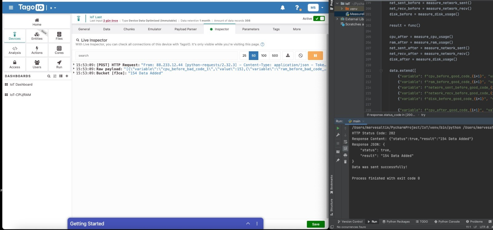
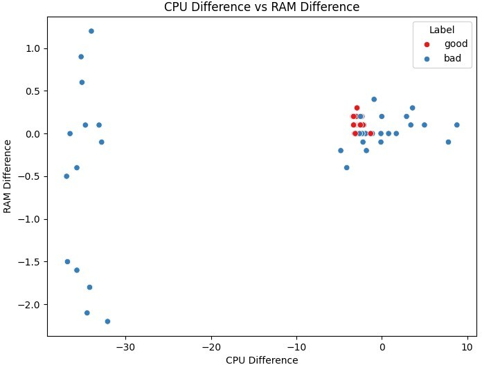
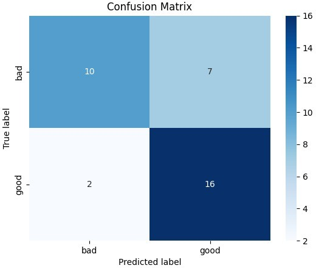

# Intelligent IoT-Based Telemetry and Adaptive Over-the-Air (OTA) Update Mechanism

## 👩🏻‍💻 Developed By

- [Merve Saltık](https://github.com/mervesaltik)
- [Sude Güzel](https://github.com/sdgzl)
- [Aleyna Menekşe](https://github.com/Aleynamnks)  

## 🧠 Project Overview

This system collects telemetry data from IoT devices (CPU, memory, network, and power metrics) and uses a machine learning model to evaluate the impact of software updates. If an update enhances device performance and stability, it is approved. Otherwise, it is blocked. This intelligent OTA update mechanism increases system resilience and reduces update-induced failures.

## 🎯 Motivation

Traditional IoT update mechanisms often ignore real-time system data, which can lead to excessive CPU loads, memory leaks, or network congestion. This project aims to:
- Evaluate real-time performance metrics.
- Apply updates only if they improve or maintain performance.
- Create a smarter, adaptive, and failure-resistant IoT ecosystem.

## 🔬 Methodology

The proposed approach combines:
- **Continuous Monitoring:** Real-time tracking of CPU, RAM, network, and power usage to understand device performance before updates.
- **Machine Learning Anomaly Detection:** ML models classify device states as “good” or “bad” based on telemetry data, helping to assess the impact of updates.
- **Adaptive OTA Updates:** Updates are only applied if they improve or maintain performance. Harmful updates are blocked automatically to protect device stability and resources.

## 📡 Telemetry Data Collection with TagoIO

To evaluate how software quality impacts system resources, we first developed Python scripts that simulate both inefficient (bad) and optimized (good) code. These scripts were executed on a local machine to measure their effects on CPU usage, RAM consumption, network activity, and disk operations. The resource data was collected in real-time and transmitted to an IoT analytics platform called TagoIO using a device token.

On the TagoIO platform:
- A virtual device was created.
- Telemetry data from each script execution was sent to this device in real time.
- The data was then exported as CSV and JSON formats for further analysis.

- **Performance Metrics Sent to TagoIO - Live Inspector:**

- **Performance Metrics Sent to TagoIO - Data:**

The exported dataset was used in a machine learning pipeline to develop a model that classifies system behavior as either “good” or “bad” based on system performance statistics.

## 🤖 Machine Learning Pipeline

The collected dataset was preprocessed as follows:

- **Missing values** were handled and **outliers** were removed.
- **Feature differences** (before and after CPU, RAM, disk, and network usage) were calculated.
- **Labels** were assigned as either "good" or "bad".
- **SMOTE** (Synthetic Minority Over-sampling Technique) was used to address class imbalance.
- All features were **scaled** for consistency.

For model training:
- **GridSearchCV** was used to find the best hyperparameters.
- Two classifiers — **Random Forest** and **K-Nearest Neighbors (KNN)** — were trained.
- These models were combined using a **Soft Voting Classifier** to boost overall prediction accuracy.

Model evaluation:
- A **confusion matrix** and **classification report** were used to assess performance.
- Visualizations showed label distribution based on **CPU** and **RAM** differences.

Finally, the trained model was saved and a **prediction function** was implemented.
This function enables **real-time classification** of incoming system telemetry data, providing a robust **decision support mechanism** for adaptive OTA updates.

## 📊 Scatter Plot And Confusion Matrix

- **Scatter Plot:**

- **Confusion Matrix:**

